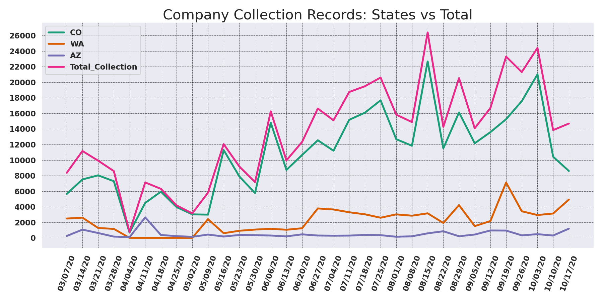
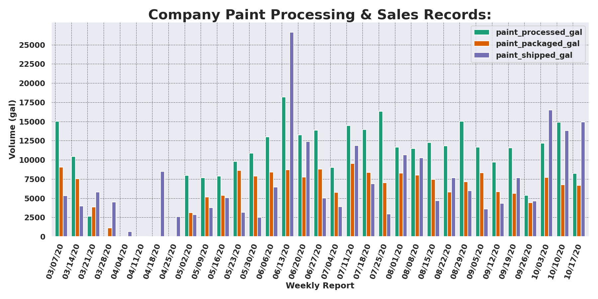
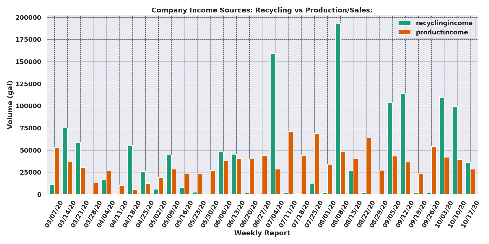
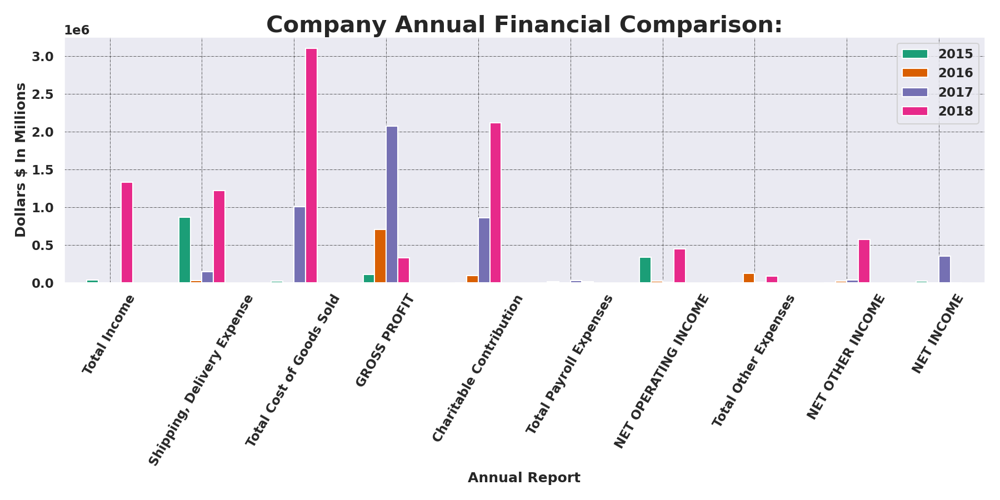

# DSI - Capstone I. Paint The Future 

### Paint Stewardship Program: Financial Assessment Of Individual Entity

##### Authored By: Gordon D. Pisciotta

## Define The Canvas: The Paint Stewardship Program
  
  1. National Goverment Implemented Program - established Non-Profit Organization - PaintCare Inc. (PaintCare.org)
    
    2. Focus is to minimize waste products ending up at landfills
    
    3. Comprehensive 10 year study to determine benefits and feasibility
    

#### Report Focus & Conclusions:

    1. Percent of Population within reasonable distance (15 minute drive) from a drop off locations
    
        - 90% of Coloradoians witin threshold
    
    2. Paint Manufacturer / Retailers / Paint Collection Network

        - 172 initial locations optimized within Colorado

## Preliminary Thoughts & Directive:

    * Initial intent was to focus on 1 prominent entity operating within this Program
    
        - Obtain & analyze detailed operational records 
        
        - Identify the variable business components & capture these aspects in various visualizations
        
        - But.... The data provided was configured by hand - adding each cell BY HAND and manually inptting every cell
                

    
    

## Course Alteration & Re-Orientation:

    * Quickly realized the focus of my project shifting to accomodate for the data source & structure
    
#### New Project Goals:

    1. Portray the current standing of the business in relation to:
        
        - Their industry
        
        - Their Historic Performance
        
        - Current Market Share
        
        - Current Levels of Paint (Sold, Leftover, Collected-By-PaintCare, Reused, Processed, & Re-Sold)

    1. Generate a Data-Pipeline to import the various data files and structures
    
    2. Efficiently clean the data into managable DataFrames
    
    3. Combine various overlapping elements from the collective data sources to construct measurable components of the business
    
    4. Identify trends within the key components of the business & capture their variability over time with visualizations    
    

### Exploratory Analysis:

    1. Applying EPA reported figures I wanted to observe the current market composition (Market-Share, Potential Market)
    

    2. Next I generated a bar-plot to view the volumes
    

    3. Narowing My Scope To the Company I configured visual representations of historical paint collection by State & Total
    

    4. 
    

  

    5. xxx
    

    6. xxx
    

    7. xxx
    

    8. xxx
    

  
## Narrowed Inquiry:
  
    * Areas of Weakness:
    
        1. 
        
        2.  
  
    * Areas of Strength:
    
        1. 
        
        2. 
 
    
## Step Back & Review:

    * 
    
    * 
    
    * 
    
  
## Forward Looking Approach
    
    1. 

    2.
    
    3. 
  
  
#### References:
