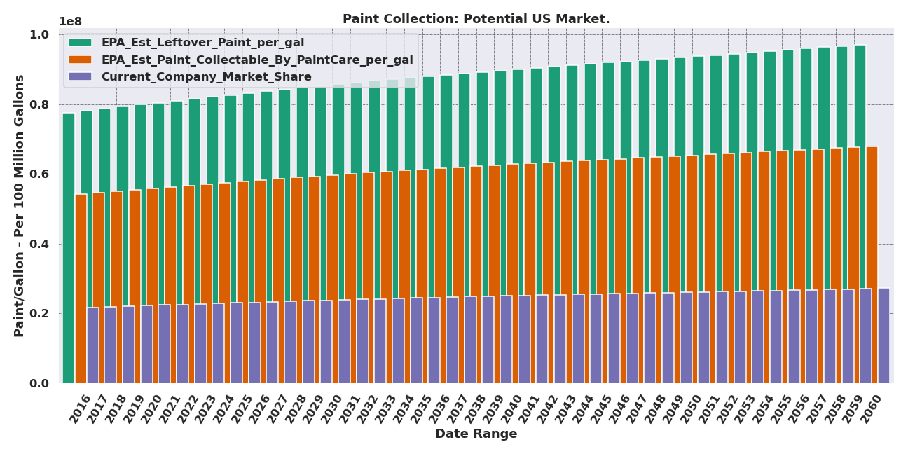

# DSI - Capstone I. Paint The Future 

### Paint Stewardship Program: Financial Assessment Of Individual Entity

##### Authored By: Gordon D. Pisciotta

## Define The Canvas: The Paint Stewardship Program
  
#### 1. National Goverment Implemented Program - established Non-Profit Organization - PaintCare Inc. (PaintCare.org)

#### 2. Focus is to minimize waste products ending up at landfills

#### 3. Comprehensive 10 year study to determine benefits and feasibility
    

### Report Focus & Conclusions:

#### 1. Percent of Population within reasonable distance (15 minute drive) from a drop off locations

* 90% of Coloradoians within threshold
    

#### 2. Paint Manufacturer / Retailers / Paint Collection Network

* 172 initial locations optimized within Colorado

## Preliminary Thoughts & Directive:

### Initial intent was to focus on 1 prominent entity operating within this Program and conduct a comprehensive analysis of their operations at current and historic levels to then gague their likelihood of future success.

* Obtain & analyze detailed operational records 
    
* Identify the variable business components & capture these aspects in various visualizations
    

### This became a significant obstacle when the data was delivered to me in hand created spreadsheets.

##### For example when I say hand created spreadsheets what I mean is the individual manually inputted every cell which resulted in instances such as: 

    

    

## Course Alteration & Re-Orientation:

* Quickly realized the focus of my project shifting to accomodate for the data source & structure
    
    
## New Project Goals:

#### 1. Portray the current standing of the business in relation to:

* Their industry

* Their Historic Performance

* Current Market Share

* Current Levels of Paint (Sold, Leftover, Collected-By-PaintCare, Reused, Processed, & Re-Sold)

#### 2. Generate a Data-Pipeline to import the various data files and structures

#### 3. Efficiently clean the data into managable DataFrames

#### 4. Combine various overlapping elements from the collective data sources to construct measurable components of the business

#### 5. Identify trends within the key components of the business & capture their variability over time with visualizations    
    

## Exploratory Analysis:

#### 1. Applying EPA reported figures I wanted to observe the current market composition (Market-Share, Potential Market)
    

#### 2. Next I generated a bar-plot to view the volumes
    

#### 3. Narowing My Scope To the Company I configured visual representations of historical paint collection by State & Total
    

#### In the above graph we can see a bar chart comparison between the 3 states within which the company has operations within

#### Above we have a representation of the Total Collection in gallons by the company across all states

#### In this 3rd visual we can see the volume each collection site(state) accounts toward the total gallons of paint collected by the company

### 4. After reviewing the company's 1st leg of business (paint collection for recycling)  I reviewed the company's ability to turn the collected leftover paint into new paint.

#### In the 2 graphs below I have generated a line and bar graph plot to display 3 of the company's vital operations over the same historical time table:

* processing of new paint

* packaging of the processed paint

* paint sold that has been shipped out for delivery
    

  

#### 5. After exploring the main operational aspects of the company (paint recycled, paint processed, paint packaged, and paint sold/shipped), I turned my focus toward the company's financial records.

* The collection of financial data I had access to was incomplete and required being pieced together from several Hand-Made spreadsheets.

* Even after wrangling the data together there were noticable missing aspects that presented issues when attempting to formulate the answer to the question, "How has the company been doing the past few years"

#### This program and company are both relatively new with both being established within the last 5 years 

* The program is still maturing and the volumes of leftover/unused paint are still extremely volatile

* The company also had to incur significant upstart costs that weighed heavily on their financial status such as machinery, facility, and manufacturing procedure

#### Their ability to reuse & repurpuse the paint they collect from recycling into new mid-grade paint is a new operational feature 

* Previously they were manufacturing their own paint from green-conscious materials but not converting material collected from the recycling program

*  Their lead engineer responsible for this concept (also responsible for the "creative" spreadsheets) is very efficient at being an engineer and as a result the company is still getting up to speed operationally

#### 6. Next I narrowed and constructed a plot of their two current facilities that are both operating in full capacity to both collect leftover paint and produce/sell recycled paint. (Colorado & Washington)

* What is very apparent observing this graph is the market share the company currently holds as a portion of the total recycled paint within the respective states

* As was the same with the previous data sets they included aspects that do not completely corespond with the surrounding data set, and that is why we also have California represented here.

* It is important to note that California has passed this measure and is expected to have the program fully implemented in 2021.

* California also has a massive potential market more than double their combined existing operations.

    

#### 7. Finally I structured a plot of the 2 most important aspects of the business, how they generate revenue.
    

    
  
# Main Takeaways:

####  Currently the company has only recently began to explore avenues to market and sell their recycled paint as their flagship product.

* Large Variability in sources of income and operational capability of the business

* Significant upside potential to maintain market share and expand into the various new markets (states) that will be bringing the program online in the coming years.

* Very little competition to their business model as they are the only name in town currently capable of generating revenue when receiving their raw materials and again when they sell their recycled paint

* The green conscious consumer is pushing All industries to explore green/alternative methods within their business operations.  This company has modeled their entire identity to capture consumer sentiment.

# Room to Grow:

### generate a series of statistical models:

##### Applying the EPA's figures that 90% of coloradians live within 15 minutes of a drop off location, and historically 10% of paint goes unused and of that paint 10% is returned for collection.

1. If a coloradian is selected at random, What is the probability they will have unused paint?

2. 1. If a coloradian is selected at random, What is the probability they will have unused paint and return it for recycling?
  
    
  
# Forward Looking Approach
    
#### 1. I would like to work with the company to generate complete standarized reports that detail their vital areas of operation such as collected leftover paint, paint converted, produced, and packaged, and of course their sales figures

#### 2. While cleaning the company documents into a form that could generate these plots and figures several accounting aspects caught my eye.

* There appeared to be obscure accounting buckets populated with unknown expenses that could potentially be more accurately itimized, tracked, and minimized to increase profitability

#### 3. If able to work with the company to formulate some sort of regularly generated reporting system and narrow down accurate figures of their business I believe there is significant value to be added through focused forcasting.

# TO RUN THIS PROJECT YOURSELF:
### 1. Open the paint.py file on your choice of editor.
### 2. run the paint.py - it will run the entire project as one continuous sequence and print out a congratulations message when completed.

# References:

* https://github.com/ramraider011235/capstone1/blob/main/data/4_supporting_data/co-annual-report-2019.pdf

* https://github.com/ramraider011235/capstone1/blob/main/data/4_supporting_data/Colorado%20Architectural%20Paint%20Stewardship%20Program%20Plan.pdf

* https://github.com/ramraider011235/capstone1/blob/main/data/4_supporting_data/epr-achievements-paint.pdf

* https://github.com/ramraider011235/capstone1/blob/main/data/4_supporting_data/xx-factsheet-transfer-station.pdf

